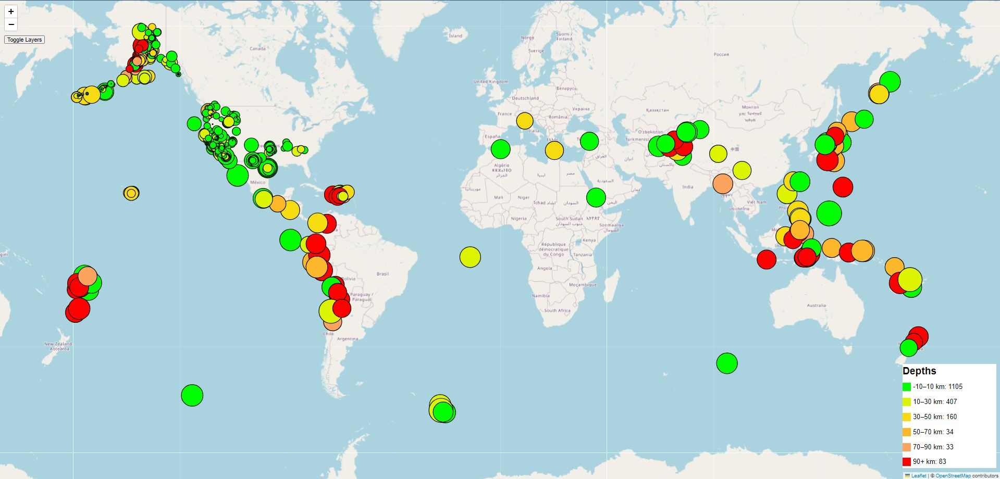
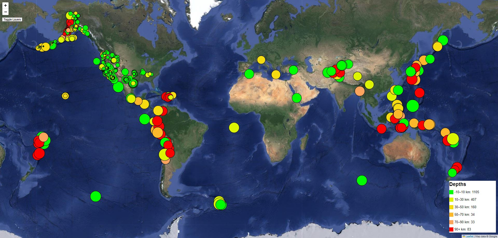

# Earthquake Visualization
## Overview
The United States Geological Survey, or USGS for short, is responsible for providing scientific data about natural hazards, the health of our ecosystems and environment, and the impacts of climate and land-use change. Their scientists develop new methods and tools to supply timely, relevant, and useful information about the Earth and its processes.

The USGS is interested in building a new set of tools that will allow them to visualize their earthquake data. They collect a massive amount of data from all over the world each day, but they lack a meaningful way of displaying it. This project develops a way to visualize USGS data that will allow them to better educate the public and other government organizations (and hopefully secure more funding) on issues facing our planet.

## Data
The first task that need to be done was to visit the [USGS GeoJSON Feed](https://earthquake.usgs.gov/earthquakes/feed/v1.0/geojson.php) page and choose a dataset to visualize. The ["All Earthquakes"](https://earthquake.usgs.gov/earthquakes/feed/v1.0/summary/all_week.geojson) GeoJSON for the Past 7 days is the dataset used in this project.   
 
The following image is an example screenshot of what appears when you visit this link:
 

## Map
After obtaining the link for the GeoJSON, a map was created that plots all the earthquakes from the imported dataset based on their longitude and latitude. Data markers reflect magnitude by their size as well as the depth of the earthquakes by color. Earthquakes with higher magnitudes appear larger, and earthquakes with greater depth appear darker in color. The colors for depth can be found on the legend that is shown on the bottom right of the map.  
 
Each marker also has a tooltip with the Location, Coordinates, Magnitude and Depth of each earthquake when clicked.  
  
### Preview of the map

On the top left of the map there is a "Toggle Layers" button that allows you to swap between the OpenStreetMap and Google Satellite views.  
 
#### The following image shows the Google Satellite view:

## Technologies Used
[D3.JS](https://d3js.org/)  
[LeafletJS](https://leafletjs.com/)
